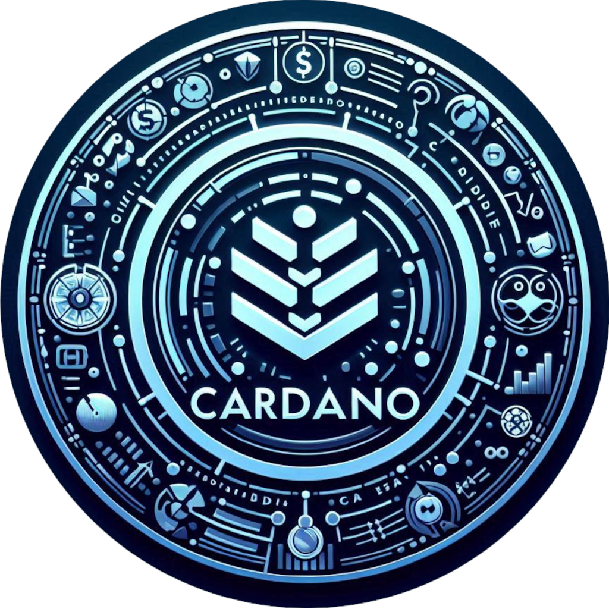

<!-- Improved compatibility of back to top link: See: https://github.com/othneildrew/Best-README-Template/pull/73 -->

<!--
*** Thanks for checking out the Best-README-Template. If you have a suggestion
*** that would make this better, please fork the repo and create a pull request
*** or simply open an issue with the tag "enhancement".
*** Don't forget to give the project a star!
*** Thanks again! Now go create something AMAZING! :D
-->

<!-- PROJECT SHIELDS -->
<!--
*** I'm using markdown "reference style" links for readability.
*** Reference links are enclosed in brackets [ ] instead of parentheses ( ).
*** See the bottom of this document for the declaration of the reference variables
*** for contributors-url, forks-url, etc. This is an optional, concise syntax you may use.
*** https://www.markdownguide.org/basic-syntax/#reference-style-links
-->
[![Contributors][contributors-shield]][contributors-url]
[![Forks][forks-shield]][forks-url]
[![Stargazers][stars-shield]][stars-url]
[![Issues][issues-shield]][issues-url]
[![MIT License][license-shield]][license-url]
[![LinkedIn][linkedin-shield]][linkedin-url]
<!-- PROJECT LOGO -->
 

  

<h3 align="center">Cardano Simple Marketplace</h3>

  

    An simple marketplace for yours NFTs.
     
    <a href="https://protofire-docs.gitbook.io/developer-studio"><strong>Explore the docs »</strong></a>
     
     
    <a href="https://youtu.be/C9Ge6xyf6-o">View Demo</a>
    ·
    <a href="https://github.com/protofire/Cardano-Simple-Marketplace/issues">Report Bug</a>
    ·
    <a href="https://github.com/protofire/Cardano-Simple-Marketplace/issues">Request Feature</a>
  

## Overview

Cardano Simple Marketplace is a decentralized application (dApp) built as an
end-to-end implementation of the Smart DB Library, designed for Cardano
blockchain integration. This marketplace allows users to buy and sell tokens
(NFTs and fungible tokens) with full blockchain interaction, supporting both
MongoDB and PostgreSQL backends.

The application demonstrates how to use the Smart DB Library for managing
tokens, metadata, and transactions in a Cardano-powered marketplace.
## Table of Contents

- [Smart DB Library: Cardano Blockchain Integration Example](#smart-db-library-cardano-blockchain-integration-example)
  - [Table of Contents](#table-of-contents)
  - [Introduction](#introduction)
  - [Features](#features)
  - [Entity Types and Pages](#entity-types-and-pages)
  - [Documentation](#documentation)
  - [Installation](#installation)
  - [Usage](#usage)
  - [Conclusion](#conclusion)
  - [Contribution](#contribution)
  - [License](#license)
  - [Acknowledgements](#acknowledgements)

## Features

- **End-to-End Blockchain Integration**: Built on top of the Smart DB Library,
  enabling seamless interaction with the Cardano blockchain.
- **Cross-Database Support**: Supports MongoDB and PostgreSQL databases for
  token and transaction management.
- **Token Marketplace**: Allows buying and selling of tokens (NFTs and fungible
  tokens) with real-time interaction on the Cardano blockchain.
- **Transaction Handling**: Includes full support for buying, selling, and
  withdrawing tokens, with real-time transaction feedback.
- **Smart UTXOs**: Manages UTXOs effectively for efficient transaction creation
  and token transfers.
- **Token Metadata**: Metadata such as images and descriptions for tokens is
  handled and displayed in the marketplace.

## Entity Types and Pages

This example project showcases different types of entities and dedicated pages
to demonstrate their functionality:

1. **MarketNFTEntity and Marketplace Page**:

   - The **MarketNFTEntity** is the central entity of the Cardano Simple
     Marketplace. It contains all the relevant information about the tokens that
     are for sale, such as the seller’s address, token price, token metadata,
     and other related details.
   - Located at `http://localhost:3000/`, the Marketplace page allows users to
     interact with the **MarketNFTEntity**, where they can:
     - **Browse Tokens**: View tokens that are listed for sale, including
       detailed metadata such as images and descriptions.
     - **Buy Tokens**: Users can select tokens to purchase, with real-time
       transaction handling powered by the Cardano blockchain.
     - **Sell Tokens**: Users can list their own tokens for sale by connecting
       their wallet and setting a price.
     - **Withdraw Tokens from Sale**: Users can remove their tokens from the
       marketplace if they no longer wish to sell them.
   - The application is integrated with wallet functionalities, allowing users
     to connect their preferred wallet to the marketplace. The wallet connection
     is essential for performing token purchases, sales, and withdrawals.
     Additionally, transaction statuses (such as successful or failed) are shown
     in real-time via modals, providing users with immediate feedback.
   - The smart contracts associated with the **MarketNFTEntity** enforce rules
     such as ensuring only the token’s creator (the seller) can list or remove
     their tokens from the marketplace. This ensures that transactions are
     securely managed and that the marketplace remains trustless and
     decentralized.

## Documentation

For detailed documentation, please visit our
[Gitbook](https://protofire-docs.gitbook.io/cardano-simple-marketplace/).

## Installation

Refer to [Installation](docs/installation.md) for detailed installation
instructions.

## Marketplace Smart Contracts (On-chain code)

Refer to [On-chain](docs/onchain.md) for detailed about testing, code and
deploy of smart Contracts.

## Usage

For information on how to use this example project, including setting up
entities, configuring the backend, and handling API routes, please refer to our
[Usage Guide](docs/usage.md).

## Conclusion

This example provides a foundational understanding of how the Smart DB library
can be utilized to build powerful blockchain applications with ease. It
showcases advanced features like Smart UTXOs and Smart Selection, demonstrating
their impact on concurrent transaction handling. Feel free to explore,
experiment, and build upon this example to create robust applications.

## Contribution

Contributions to the Cardano Smart DB are welcome. Whether you're looking to fix
bugs, add new features, or improve documentation, your help is appreciated.

## License

This project is licensed under the GNU General Public License v3.0 - see the
[LICENSE](LICENSE) file for details.

## Acknowledgements

We express our deepest gratitude to the Cardano community for their unwavering
support and valuable contributions to this project. This work is part of a
funded project through Cardano Catalyst, a community-driven innovation platform.
For more details on the proposal and its progress, please visit our proposal
page on [IdeaScale](https://cardano.ideascale.com/c/idea/110478).

<!-- MARKDOWN LINKS & IMAGES -->
<!-- https://www.markdownguide.org/basic-syntax/#reference-style-links -->
[contributors-shield]: https://img.shields.io/github/contributors/protofire/Cardano-Simple-Marketplace.svg?style=for-the-badge
[contributors-url]: https://github.com/protofire/Cardano-Simple-Marketplace/graphs/contributors
[forks-shield]: https://img.shields.io/github/forks/protofire/Cardano-Simple-Marketplace.svg?style=for-the-badge
[forks-url]: https://github.com/protofire/Cardano-Simple-Marketplace/network/members
[stars-shield]: https://img.shields.io/github/stars/protofire/Cardano-Simple-Marketplace.svg?style=for-the-badge
[stars-url]: https://github.com/protofire/Cardano-Simple-Marketplace/stargazers
[issues-shield]: https://img.shields.io/github/issues/protofire/Cardano-Simple-Marketplace.svg?style=for-the-badge
[issues-url]: https://github.com/protofire/Cardano-Simple-Marketplace/issues
[license-shield]: https://img.shields.io/github/license/protofire/Cardano-Simple-Marketplace.svg?style=for-the-badge
[license-url]: https://github.com/protofire/Cardano-Simple-Marketplace/blob/master/LICENSE
[linkedin-shield]: https://img.shields.io/badge/-LinkedIn-black.svg?style=for-the-badge&logo=linkedin&colorB=555
[linkedin-url]: https://www.linkedin.com/company/protofire-io/posts/?feedView=all
[product-screenshot]: images/screenshot.png
[usage-example]: images/example.png
